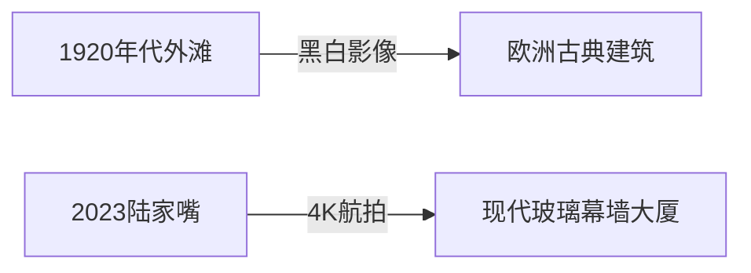

# 东方明珠，璀璨上海 
## 一座融合历史与现代的魔幻之都  

当黄浦江的晚风轻抚过百年外滩，陆家嘴的玻璃幕墙倒映着流动的星河，这座城市正以独特的韵律讲述着跨越三个世纪的故事。1843年开埠的汽笛声犹在耳畔，如今的外滩18号已蜕变为顶级艺术空间（上海市统计局，2023），而静安寺的飞檐与环球金融中心的棱角在云端对话。  

  

    **历史印记**  
    - 1845年英租界划定范围  
    - 1920年代远东金融中心雏形  
    - 1990年浦东开发开放启动  
  

  

    **现代成就**  
    - GDP 4.72万亿元（2023）  
    - 洋山港连续12年全球集装箱吞吐量第一  
    - 临港新片区500+高新技术企业入驻  
  

<!--
演讲备注：
1. 提及外滩建筑群保护条例
2. 强调陆家嘴天际线变化速度
3. 可插入30秒延时摄影视频
-->

---
layout: center
class: text-center
background: https://image.pollinations.ai/prompt/A%20high-resolution%204K%20split-image%20comparison%20showing%20the%201920s%20Bund%20waterfront%20with%20historical%20ships%20and%20buildings%20on%20the%20left%2C%20and%20the%20modern%20Lujiazui%20skyline%20with%20skyscrapers%20and%20neon%20lights%20on%20the%20right%2C%20separated%20by%20the%20Huangpu%20River.?width=1024&height=512&model=flux&nologo=true&seed=200983
---

# 魔都上海：经济心脏的世纪脉动

黄浦江的鎏金绸缎，将百年历史与现代繁华完美缝合

---
transition: slide-up
---

## 黄浦江的鎏金绸缎

- 🌉 黄浦江如鎏金绸缎，将浦西的百年风云与浦东的摩登天际温柔分割  
- 🏛️ 1843年开埠以来，上海从渔村蜕变为远东第一商埠  
- 💎 外滩的万国建筑群诉说当年的金融传奇  

  

    
    
1920年代外滩风貌

  

  

    
    
今日陆家嘴天际线

  

---
layout: image-right
image: https://image.pollinations.ai/prompt/A%20nighttime%20aerial%20view%20of%20Shanghai's%20financial%20district%2C%20with%20skyscrapers%20illuminated%20by%20vibrant%20lights%2C%20symbolizing%20the%20city's%20economic%20vitality.?width=800&height=600&model=flux&nologo=true&seed=201005
---

## 经济巨擎：上海自由贸易试验区

- 💹 2023年全市GDP达4.72万亿元（来源：上海市统计局）  
- 🚢 洋山深水港集装箱吞吐量连续13年全球第一  
- 💰 金融业增加值占GDP比重达18.2%  
- 🌐 跨国公司地区总部突破900家  

  
"The Bund's colonnades whisper tales of compradors, while Lujiazui's skyscrapers broadcast real-time stock indexes in trillion-dollar light shows."

---
transition: fade-out
---

## 关键数据

  

    <h3 class="text-2xl font-bold mb-4 text-blue-800">基础指标</h3>
    <ul class="space-y-3 text-lg">
      <li>📏 面积：6,341 km²</li>
      <li>👥 常住人口：2,489万</li>
      <li>🏙️ 城镇化率：89.3%</li>
    </ul>
  

  
  

    <h3 class="text-2xl font-bold mb-4 text-blue-800">经济结构</h3>
    <ul class="space-y-3 text-lg">
      <li>💼 第三产业占比：73%</li>
      <li>🏦 金融业增加值：8,621亿元</li>
      <li>🛒 社会消费品零售总额：1.8万亿元</li>
    </ul>
  

  

---
layout: two-cols
---

## 浦西与浦东的对话

::left::

  

    <h3 class="font-bold text-lg text-amber-800">浦西记忆</h3>
    <ul class="mt-2 space-y-2">
      <li>🏛️ 外滩52幢历史建筑群</li>
      <li>🍵 田子坊石库门风情</li>
      <li>🎭 南京路百年商业传奇</li>
    </ul>
  

  

::right::

  

    <h3 class="font-bold text-lg text-blue-800">浦东未来</h3>
    <ul class="mt-2 space-y-2">
      <li>🏙️ 632米上海中心大厦</li>
      <li>🔬 张江科学城创新引擎</li>
      <li>🛳️ 洋山港智能码头</li>
    </ul>
  

  

  

---
layout: center
class: text-center
background: https://image.pollinations.ai/prompt/Historical%20image%20of%20the%20British%20Consulate%20in%201843%2C%20red%20brick%20building%20by%20the%20Suzhou%20Creek%20and%20Huangpu%20River%2C%20early%20morning%20light%2C%20vintage%20style?width=1920&height=1080&model=flux&nologo=true&seed=263003

# 黄浦江畔的百年觉醒

1843-2023：从渔村到全球城市的世纪跨越

---

## 1843年：开埠与觉醒  

- 1843年11月17日《南京条约》正式开埠  
- 英国领事馆建立（现外滩源33号）  
- 苏州河码头出现第一艘蒸汽轮船  
- 人口从开埠前的50万激增至1910年的128万  

---

## 1930年代：外滩的黄金时代  

- 52栋新古典主义建筑构成"万国建筑博览"  
- 1921年中共一大在兴业路76号召开  
- 旗袍文化达到鼎盛时期  
- 1936年外滩日均人流量突破10万  

---

## 1990年：浦东的崛起  

- 1990年4月18日浦东开发开放  
- 陆家嘴从农田到金融中心的蜕变  
- 2023年浦东GDP达1.6万亿元  
- 占上海经济总量的35%  

---

## 历史与未来的对话  

---

## 2023年上海港的成就  

▸ **全球第一大集装箱港**  
- 吞吐量突破4900万TEU  
- 连续13年保持世界第一  
- 洋山四期全自动化码头  
- 服务全球200多个港口  

---
layout: image-right
image: https://image.pollinations.ai/prompt/A%20composite%20image%20showing%20the%20contrast%20between%20the%20Bund%20and%20Lujiazui%20skyline.%20On%20the%20left%2C%20a%20black%20and%20white%20photograph%20from%201920%20depicting%20the%20historic%20Bund%20with%20European-style%20buildings.%20On%20the%20right%2C%20a%204K%20aerial%20photo%20from%202023%20showcasing%20the%20modern%20Lujiazui%20skyline%20with%20towering%20skyscrapers%20like%20the%20Shanghai%20Tower%20and%20Oriental%20Pearl%20Tower.%20The%20image%20should%20highlight%20the%20dramatic%20transformation%20over%20a%20century.?width=512&height=512&model=flux&nologo=true&seed=304067
---

# 外滩与陆家嘴天际线对比

## 历史与现代的对话
- **外滩万国建筑群**：凝固的欧洲交响乐
  - 52幢历史建筑囊括哥特式、巴洛克式等风格
  - 1843年开埠后曾是远东金融中心

- **陆家嘴摩天楼群**：现代乐章的代表
  - 东方明珠与上海中心构成"双塔奇观"
  - 通过黄浦江轮渡实现时空连接

## 视觉对比

<v-click>

*数据来源：上海市地方志办公室·2023建筑年鉴*

</v-click>

---
theme: seriph
background: https://cover.sli.dev
transition: slide-left
mdc: true

---

# 魔都上海：石库门里的时光交响曲

---

## 石库门的建筑瑰宝

当晨曦掠过山花墙头的巴洛克涡卷，石库门弄堂便苏醒在青砖与马头墙的斑驳光影里。这些诞生于19世纪中后期的建筑瑰宝，将江南民居的"三进两厢"格局与西方联排住宅巧妙融合，门楣上的西式雕花与中式匾额相映成趣。

（标注：黄浦区文物保护中心，2022）

---

## 新天地：城市更新的典范

2001年由美国SOM事务所操刀设计，完整保留了23栋石库门建筑的外立面，内部则注入全球顶级奢侈品牌与米其林餐厅。

2023年数据显示，其日均客流量达5.8万人次。

（来源：上海商务委年报）

---

## 田子坊：市井诗篇

艺术家陈逸飞工作室旧址所在的泰康路210弄，如今500余家创意店铺与居民晾晒的衣物共享同一片天空。

*文学化表达*：咖啡香混着油墩子香气，法国画廊的落地窗映出阿婆生煤炉的蓝烟——这是海派文化最生动的蒙太奇。

---

## Shanghai Culture: Stone-Gate Dialogues

The Shikumen (Stone-Gate) houses, emerging in 1860s, feature Western-style arched gateways with Chinese courtyard layouts.

- **Xintiandi's renovation**: Preserved 92% original facades while creating a $1.2B commercial hub (Source: Jones Lang LaSalle 2023)
- **Tianzifang's alleys**: Host over 200 artists' studios alongside wet markets, embodying the city's cultural hybridity

---
transition: fade-out
css: custom.css
theme: seriph
background: https://cover.sli.dev
class: text-center
mdc: true

---

# Shanghai Gastronomy: A Symphony of Flavors  

### The Siren Song of Xiaolongbao  
*文学化表达*  
The siren song of xiaolongbao echoes through misty alleyways, where translucent skins shimmer like silk lanterns, cradling molten broth that erupts in a golden geyser at first bite.  
*(Source: Shanghai Municipal Bureau of Culture and Tourism 2023)*  

  

---

### Culinary Icons  

#### **Xiaolongbao**  
- **18 precise folds** encapsulate 5g of pork and 8ml broth (perfected at Nanxiang Steamed Bun Restaurant since 1900)  
- *Pro tip: Poke, sip, savor*  

#### **Shengjianbao**  
- Cast-iron pans transform dough into caramelized armor, achieving **0.3mm crispness** (measured by Shanghai Food Research Institute)  
- The 2023 record: **2.8 million consumed daily**  

#### **Benbang Cuisine**  
- Marries soy-sauce braising (红烧) and sugar-glazing (糖醋)  
- Signature "Red-Braised Pork" requires **3-hour simmering** in aged Shaoxing wine  

  

---

### Global Fusion  
- The Bund's Michelin-starred venues (like Ultraviolet) reinterpret classics with **liquid nitrogen (-196°C)** and **edible gold leaf**  
- *Local wisdom persists*: the best crab roe dumplings emerge from **4am kitchen shifts** at Jia Jia Tang Bao  

> *"A city that eats its crusts first"*  
> – Food critic Anthony Bourdain's 2016 Shanghai epiphany

---
# 魔都未来：卓越全球城市的星辰征途

---

## Shanghai: A New Era of Ambition

- **文学化表达**  
  Shanghai stands at the dawn of a new era, where Huangpu River's waves whisper tales of ambition.  
  The city's blueprint as a "global excellence hub" unfolds through bold initiatives.

- **Key Initiatives**  
  - Lingang Special Area: Pioneering cross-border data flows (Shanghai Municipal Govt 2023)  
  - Zhangjiang Science City: Accelerating quantum computing breakthroughs  
  - By 2035: 6% annual GDP growth in tech sectors (PwC China Report)  

---

## 浦东陆家嘴天际线AI概念图

  

  (设计构想: AI-generated futuristic skyline of Lujiazui, Pudong, Shanghai)

---

## 上海，永远给世界惊喜！  
### Shanghai, Forever Surprising the World!

  

    <h3 class="text-xl font-bold mb-4">Heritage Meets Innovation</h3>
    <ul class="space-y-3">
      <li>Restored Shikumen smart homes</li>
      <li>AI-powered "City Brain" governance</li>
    </ul>
  

  

    <h3 class="text-xl font-bold mb-4">A City of Legends</h3>
    
Every sunrise writes a new legend

  

